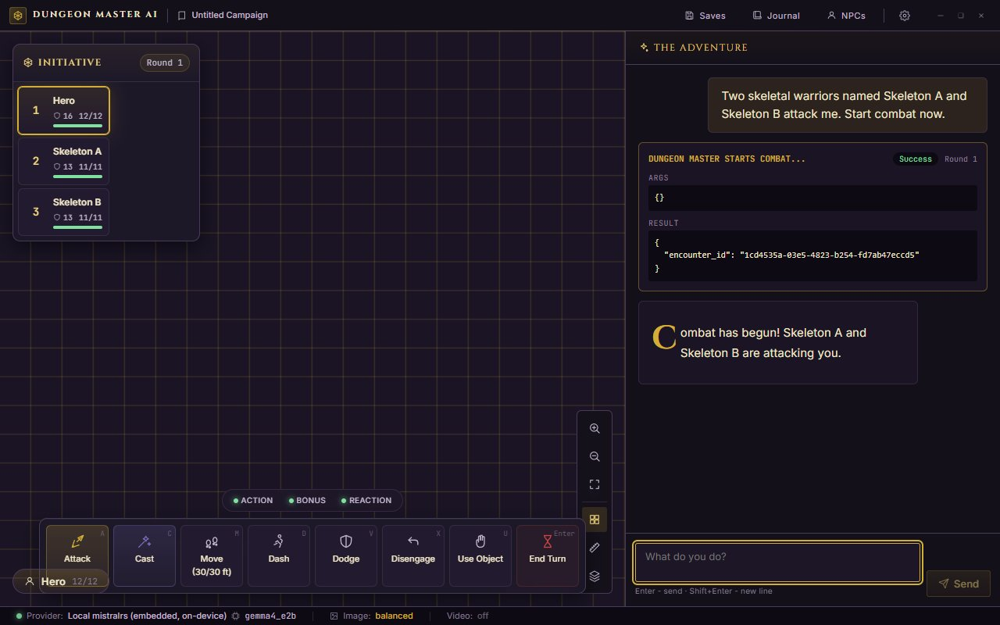
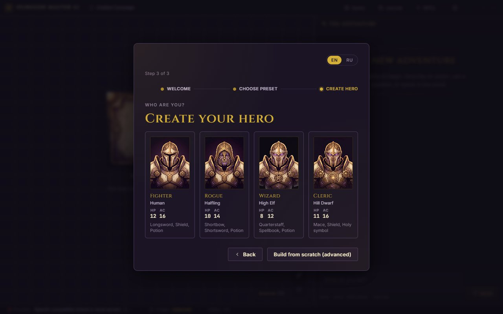

# Dungeon Master AI

[](LICENSE) [](#stack)

A multimodal, AI-powered Dungeons & Dragons desktop assistant. Tauri v2 + React + Rust.

It runs a solo D&D 5e session for you: an agentic Dungeon Master narrates, drives NPCs, resolves combat on a virtual tabletop, remembers your campaign, and can generate scene art - either fully on your machine or through a cloud model.

<p align="center">
  
  
</p>

> **Status: v0.12.1 (real engine).** Real server-rolled combat (initiative,
> turn-gating, conditions, damage resistance, spell resolution), SRD rules
> retrieval (RAG), real scene persistence and saves, and video generation. The
> app completes end to end: onboard by any preset, create or pick a character,
> chat with the DM, resolve a combat round on the VTT, generate an image, save,
> and restart with state preserved. Both the local-only path (embedded LLM +
> image sidecars) and the cloud path (any OpenAI-compatible endpoint, OpenRouter
> recommended) work.

## Features

- **Agentic DM loop.** A multi-round agent turns your message into narration plus tool calls: dice rolls, `start_combat` / `apply_damage` / `apply_healing` / token updates, `set_scene`, `remember_npc` / `recall_npc`, `journal_append`, `quick_save`, and `generate_image`. Tool results feed back into the next round.
- **Combat VTT.** PixiJS virtual tabletop with draggable tokens, HP/AC chips, condition rings, AoE templates, an initiative tracker, and an action bar that sends typed commands. The UI updates mechanics only from newer authoritative server revisions.
- **Character creation.** A full level-1 wizard (class, race, background, abilities by point-buy / standard array / 4d6, skills, spells, equipment, persona, AI-assisted portrait) plus quick preset heroes. Characters commit real combat stats (HP, AC, initiative, speed, proficiency bonus).
- **Multimodal chat.** Stream narration with reasoning surfaced in a collapsible pill; attach images (vision) to a turn; render tool-call cards inline.
- **Providers.**
  - **Local-first:** an embedded `mistralrs` LLM sidecar (Qwen3.5 GGUF, vision capable) and a Python image/video sidecar (SDXL-Lightning / Z-Image-Turbo / FLUX / LTX-Video), owned by Tauri and controlled through an authenticated loopback channel. Models download from HuggingFace.
  - **Cloud:** a single generic **OpenAI-compatible** provider. OpenRouter is the recommended hosted aggregator (one key, 100+ models, including Claude). Point it at any `/v1/chat/completions` endpoint - LM Studio, Ollama, llama.cpp, vLLM, Groq, DeepSeek, a LiteLLM proxy, etc. (Native Anthropic was removed in M11; route Claude through OpenRouter.)
- **Persistence.** SQLite via `sqlx` (campaigns, sessions, messages, snapshots, combat); secrets in an encrypted Stronghold vault; linear saves with quick-save, overwrite, and load. State survives a restart.
- **Localization.** Full English + Russian UI (react-i18next), Cyrillic-capable body/mono fonts.

## Stack

- Desktop shell: Tauri v2 (Rust), the sole owner of `dmai-server` and optional model/media sidecars.
- Frontend: React 19 + TypeScript + Vite + Zustand + react-i18next, PixiJS v8, valibot for runtime schemas.
- Backend: Rust workspace - axum HTTP server; `genai` for the LLM provider abstraction behind an atomic-swappable `RwLock<Arc<ProviderRegistry>>` (chat / image / video slots).
- Toolchain: Bun (package manager + scripts) + Biome (lint + format).
- Targets: Windows, macOS, Linux. (Local GPU sidecars are tuned for an NVIDIA RTX 3080 / Ampere; CPU fallbacks exist.)

## Repo layout

```
crates/
  app-domain/       deterministic D&D 5e rules and pure SRD concepts
  app-application/  use cases, typed models, and inward-owned ports
  adapter-http/     axum routes, DTO validation, and SSE mapping
  adapter-sqlite/   SQLx repositories, transactions, and migrations
  adapter-llm/      concrete LLM and embedding providers
  adapter-media/    HuggingFace, downloads, image/video, runtime control client
  adapter-secrets/  Stronghold and test secret stores
  app-bootstrap/    backend composition and dmai-server entry point
  app-llm/          compatibility provider facade
  app-server/       compatibility server/test facade
sidecar/            Python 3.12 image/video generation process
src-tauri/          Tauri process owner, runtime control, capabilities, packaging
src/                React app, feature controllers, projections, UI, locales
e2e/            Playwright smoke tests (localStorage-backed Tauri mock)
docs/           architecture + milestone specs/plans (planning dir, gitignored)
```

## Dev setup

Prerequisites:

- Rust stable: `rustup default stable`
- [Bun](https://bun.com/) 1.3+
- Tauri prerequisites for your OS: https://tauri.app/start/prerequisites/
- For the cloud path: an OpenAI-compatible endpoint + key (OpenRouter recommended).
- For the local path: a built `mistralrs-server` + the Python image sidecar (see the prebuild CI workflows); models download from HuggingFace on first use.

```bash
bun install
bun run install-hooks   # one-time: pre-commit (fast gates) + pre-push (full gates)
bun run tauri dev       # Vite + the Rust backend (dmai-server) - enough for CLOUD mode
```

`bun run tauri dev` builds and spawns the Rust backend automatically. It does NOT build/start the model sidecars (mistralrs LLM + Python image) - those are on-demand and need a one-time build:

```bash
bun run setup:local            # build mistralrs-server + create .venv for the image sidecar
bun run setup:local --cuda     # GPU build (needs the CUDA toolkit / nvcc on PATH; RTX 3080)
bun run dev:all                # sets DMAI_IMAGE_SIDECAR_DEV + preflights sidecars, then tauri dev
```

For CLOUD mode (OpenAI-compatible / OpenRouter) plain `bun run tauri dev` is all you need - no sidecars. Onboarding walks you through picking a preset (Local-only, Cloud, Hybrid, Text-only, or Manual), configuring a provider, and creating a hero. F11 toggles fullscreen; Ctrl+S quick-saves.

### Example cloud Settings

| Provider | Base URL | Example model |
| --- | --- | --- |
| OpenRouter (recommended) | `https://openrouter.ai/api/v1` | `anthropic/claude-3.5-sonnet`, `qwen/qwen-2.5-7b-instruct` |
| LM Studio | `http://localhost:1234/v1` | whatever you loaded |
| Ollama | `http://localhost:11434/v1` | `qwen3:1.7b`, `llama3.2` |
| vLLM | `http://localhost:8000/v1` | model alias |
| Groq | `https://api.groq.com/openai/v1` | `llama-3.3-70b-versatile` |
| DeepSeek | `https://api.deepseek.com/v1` | `deepseek-chat`, `deepseek-reasoner` |

## Tests and gates

`scripts/gates.sh` is the single source of truth for the quality gates - the same script backs the git hooks AND the CI `lint` job, so local and CI can never drift.

```bash
bun run gates        # full set: cargo fmt --check, clippy --all-features, biome ci,
                     #           architecture, tsc, cargo test, vitest, em-dash
bun run gates:fast   # fast subset: fmt, biome, architecture, tsc, em-dash
bun run e2e          # Playwright (its own CI job; not in gates.sh - needs a browser download)
bun run e2e:tauri    # deterministic real Tauri/WebView smoke
python -m ruff check sidecar
python -m pytest sidecar/tests -q
```

Hooks (installed via `bun run install-hooks`): **pre-commit** runs `gates.sh --fast` (seconds), **pre-push** runs the full `gates.sh`. Bypass once with `--no-verify`.

## Build

```bash
bun run tauri build
```

## Backlog (deferred)

- Distribution: signed installers + GitHub Releases with bundled binaries.
- Branching saves + the Chronicles tome UI (v1 is linear saves).
- VTT zoom/pan, light theme, density toggle.
- Live scene-transition video generation (pre-recorded mp4 is canonical today).
- A self-hosted Cyrillic fantasy-serif display face (headings currently fall back to a serif with Cyrillic; the display face is Latin-only).
- mistralrs reasoning/thinking surfacing (blocked on upstream).
- Additional / regional cloud providers.

## Known limitations

Current, confirmed issues (see `CHANGELOG.md` for the per-release detail):

- Local GGUF loading crashes after the model loads in a non-TTY context on Windows (upstream `mistralrs`). The default Gemma / ISQ local path works, so prefer an ISQ model id over a raw GGUF on Windows.
- `mistralrs` reasoning/thinking surfacing is not wired up yet (blocked on upstream).
- A small set of accepted Biome diagnostics remains (test-only non-null assertions, exhaustive-deps, descending-specificity, and a configuration deprecation notice). They are non-blocking and do not fail the gates.
- Local model/media bundles are built separately from the normal cloud-only release matrix; a green cloud bundle does not prove the GPU path.
- Distribution is unsigned for now: self-signed Windows installers trigger SmartScreen "Unrecognized app" warnings until an EV certificate lands (see `docs/RELEASE.md`).

## License

MIT. See [LICENSE](LICENSE).
